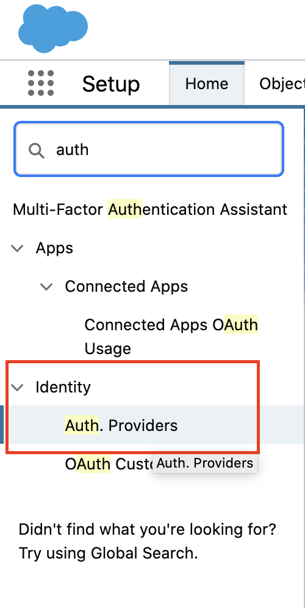
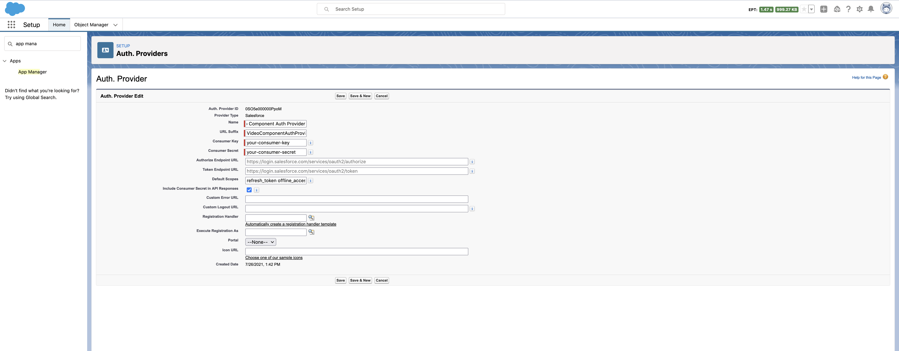
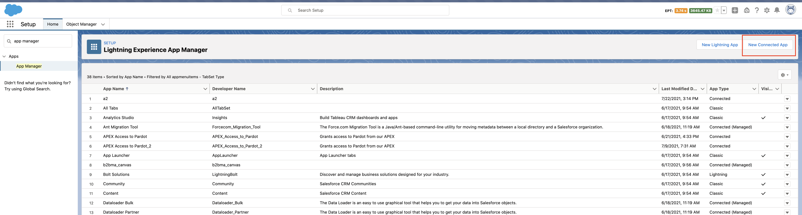
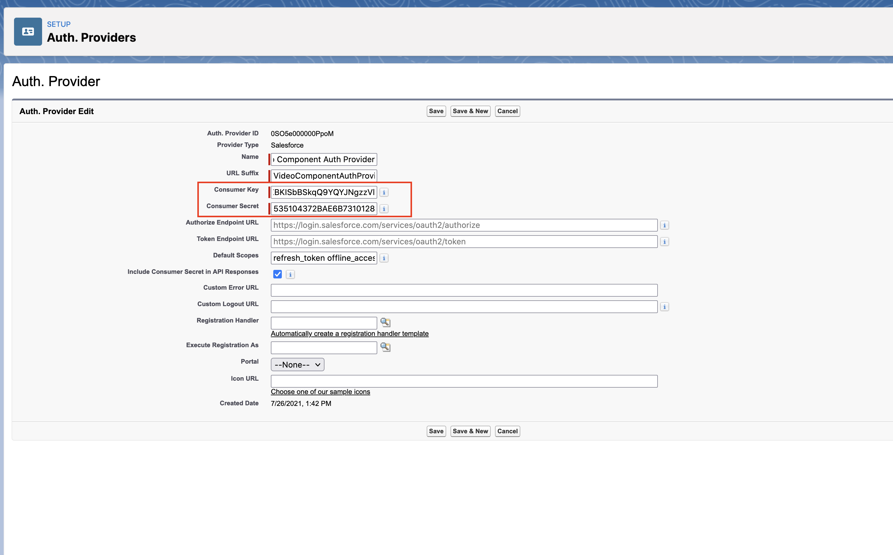
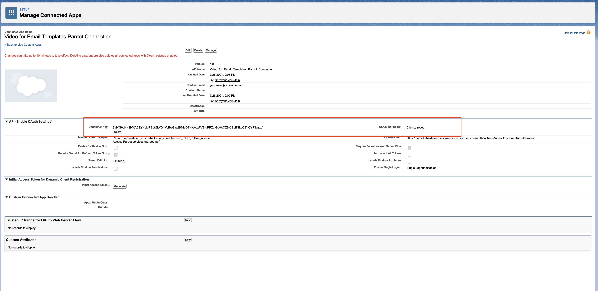
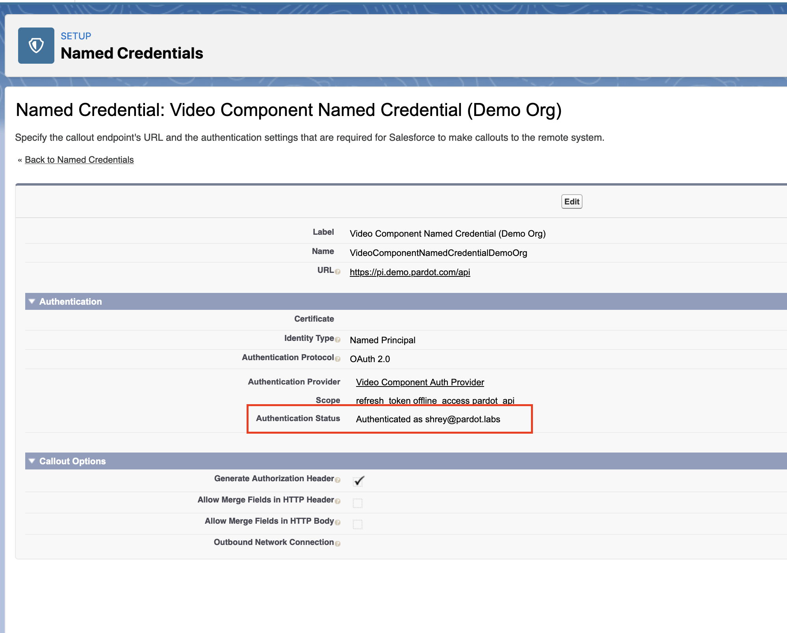
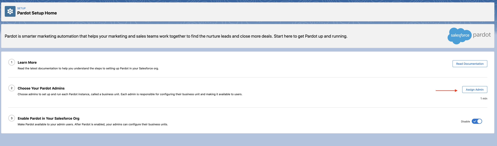
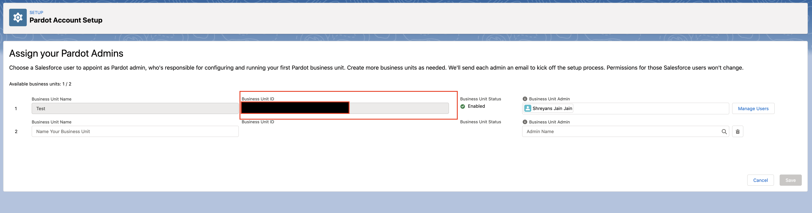
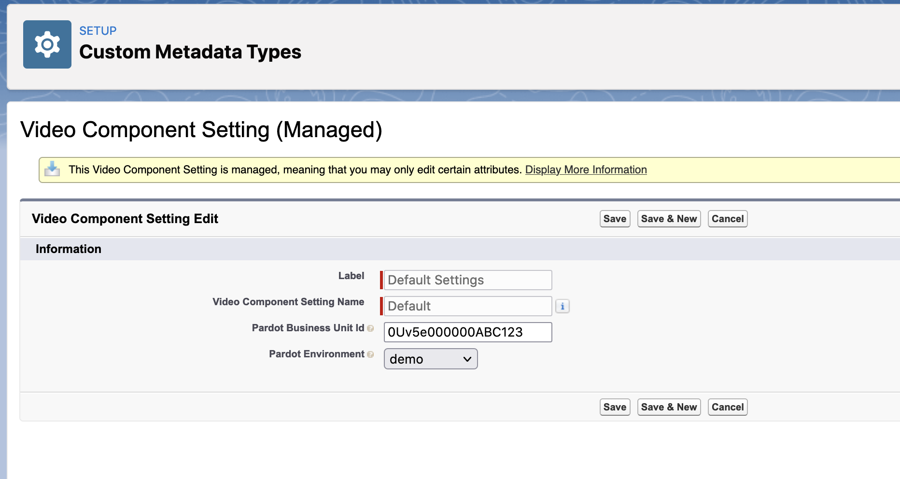

# Connecting a Pardot Org

Connecting the component with a Pardot Org, lets you track the video link clicks via Pardot Custom Redirects. To learn more about Custom Redirects, please see this [blog post.](https://www.pardot.com/blog/custom-redirects/)

You can connect to a Pardot Org with these easy steps:

### Part 1 (Authenticating Pardot)

1. Open 2 tabs with Salesforce Setup Pages. You can do this by Clicking the Gear Icon and Clicking 'Setup'. Once the first setup page opens (Tab 1), click the Gear Icon and click 'Setup' again. This opens another Setup Page (Tab 2)
1. Go to Tab 1 Setup page and type 'Auth' in the search box
   
1. Click on Auth Providers
1. Select _Video Component Auth Provider_
1. Copy the Callback URL as shown in the screenshot below
   
1. Keep this tab open, and go to Tab 2
1. Type 'App Manager' in search box
1. Click on 'New Connected App'
1. Fill in the details as shown in the screenshot below
   
   1. Give the new connected App any name. For example: 'Video for Email Templates Pardot Connection. The API Name should be filled automatically.
   1. Provide your Contact email address
   1. Click on 'Enable Oauth settings'
   1. Paste Callback URL from Step 4. Go back to Tab 1 to copy it again
   1. Select the 2 scopes as shown in the screenshot
      1. Access Pardot services (pardot_api)
      1. Perform requests on your behalf at any time (refresh_token, offline_access)
1. Click Save and then click continue
1. Now go back to Tab 1 with Auth Provider and click 'Edit'
1. On the next screen you only need to modify 2 values for Auth provider:
   
   1. Consumer Key: This is the Consumer Key in tab 1
      
   1. Consumer Secret: This is the Consumer Secret in tab 1
1. Click Save
1. In the quick find box, type 'Named Credentials' and click on Named Credentials.
1. Select the named credentials named:Video Component Named Credential (Demo Org). This connects to your Pardot Sandbox. If you are connecting to your Pardot Production Account then select Video Component Named Credential (Production Org)
1. Click Edit
1. No need to modify any values. Simply Click Save.
1. This should give you a login screen. Login with your credentials.
1. Review the notice on the next page and click Allow.
1. You will now notice that your Authentication Status changed to Authenticated as "your username"
   

### Part 2 (Providing Business Unit Id)

Now that we have authenticated Pardot, the last step is to provide our Business Unit Id.

1. Type _Pardot Setup_ in the quick find box. Select Pardot Setup Home.
   
1. Click on the assign Admin Button in Step 2
   
1. On next page copy the Business Unit Id for the Pardot Org that you want to connect to
1. Type _Custom Metadata_ in the Quick Find box and click on Custom Metadata Types
1. Find a Custom Metadata Type named _Video Component Setting_ and click on Manage Records
1. Click on Edit for the row named _Default Settings_
   
1. Paste you Pardot Business Unit Id from step 3 in the Pardot Business Unit Id field.
1. Leave the Pardot Environment field as _Demo_ if you are connected to Pardot Demo Environment. Change it to Production only if you are connecting to the production environment.
1. Congratulations! You have connected the component with Pardot successfully.

## [Create a GitHub issue](https://github.com/shrej/email-video/issues) for bug reports, feature requests, or questions.
