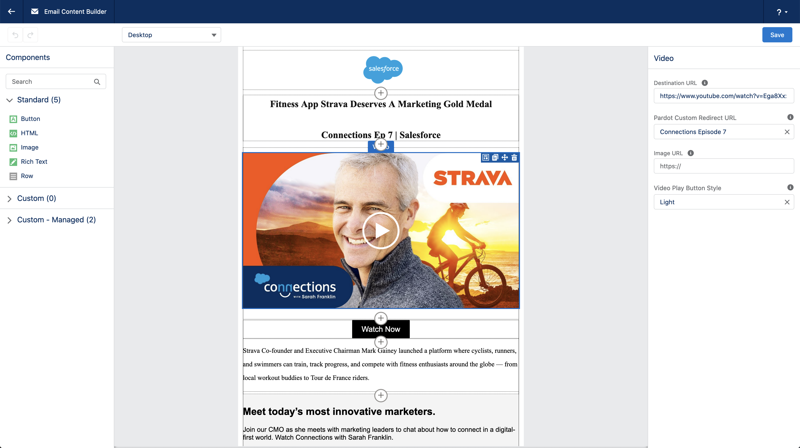

# Getting Started with Video for Email Templates

We have designed this component to be used with or without a Pardot Account.
If you connect a Pardot Account, you get the additional ability to add custom redirects as your destination without ever leaving the Email Template Builder.

## Prerequisites

1. **Install the component** 
   Though you can install this component directly in a production org, we recommend installing it in a sandbox first.

1. **Now go to any lightning email template in your org, and click Edit in builder** 
   If you do not see the "Edit in builder" option, please follow the instructions [here.](https://help.salesforce.com/articleView?id=email_template_builder_create.htm&type=0)

## Usage

1. Add the component anywhere on your email template/content
1. Provide a destination URL. This is where the email recipients would go when they click on the thumbnail. If this is a Youtube/ Dailymotion URL, we will fetch the thumbnail automatically.
1. Select a Custom Redirect for the video thumbnail
1. Optionally, you can also set a custom image as your thumbnail
1. Choose from Light/ Dark play button to best suit your image

 Proceed to watch a [demo.](demo)

To utilize this component to its full potential we recommend connecting this component with Pardot. Follow these easy steps to add the ability to select Pardot Custom Redirects without ever leaving the Email Template Builder.

[Connect with Pardot](connectingpardot)

## Contact & Support

- Create a [GitHub issue](https://github.com/shrej/email-video/issues) for bug reports, feature requests, or questions
- Add a ⭐️ [star on GitHub](https://github.com/shrej/email-video) or ❤️ [tweet](https://twitter.com/intent/tweet?url=https%3A%2F%2Fgithub.com%2Fshrej%2Femail-video&hashtags=salesforcelabs,pardot) to support the project!

<!-- GitHub Buttons -->

